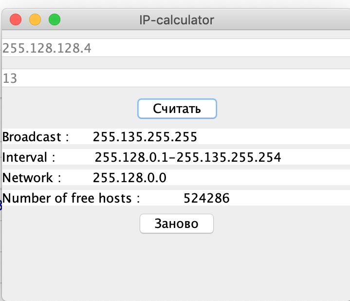

# IP-calculator
It is small IP-calculator
You should set IP-adress and mask and then you can find :
1) broadcast
2) interval of min host - max host
3) network adress
4) number of free hosts

Source java files in src.
Compiled program is NetWhat.jar, program run with
2-mouse click.
Than you'll see GUI window and you'll be able to set your
mask and ip-adress.
;
--------------------------------------------------------
You also must install JDK!
